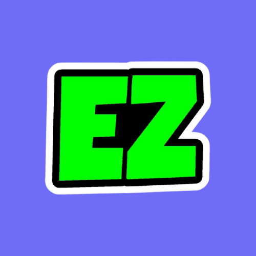

# EzCapture

Simple and Easy-to-use Screen Recorder right in the web

## Features

- Downloads in .webm format
- Previews before recording
- Open source and on the web
- Records voice from device and microphone

  
## Screenshot

  
## Built with 

  
## Contributing

Contributions are always welcome!

Please read `contributing.md` for more info!

  
## License

[Apache](https://www.apache.org/licenses/LICENSE-2.0)

  
## 🔗 Links

  
## Feedback

If you have any feedback, please reach out to us at rainboestrykr@gmail.com

  
## Support

  
